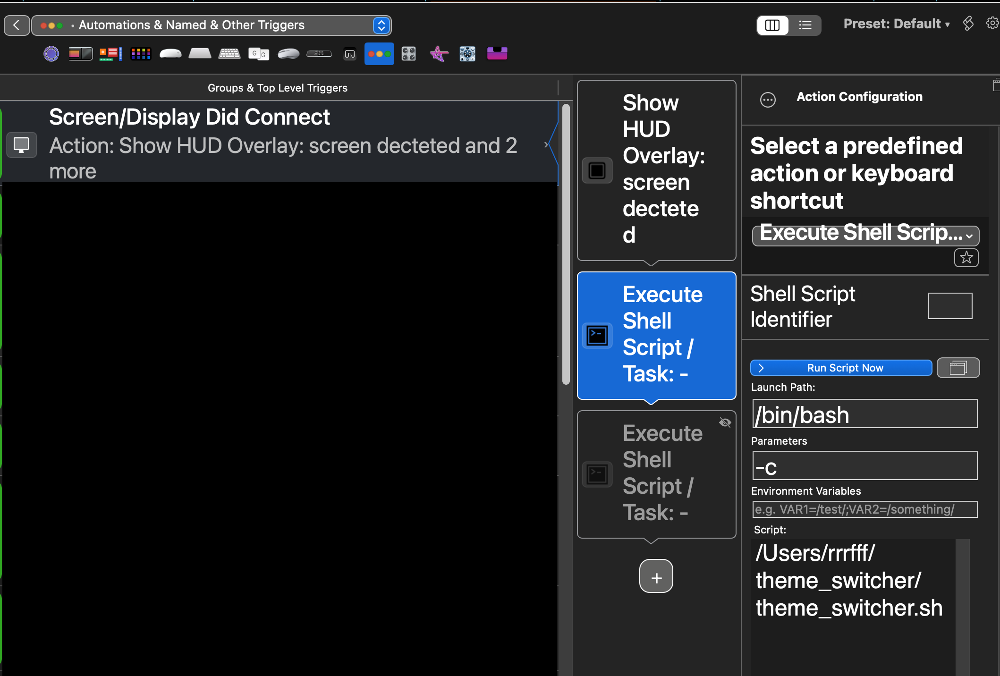
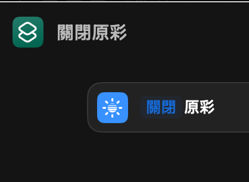
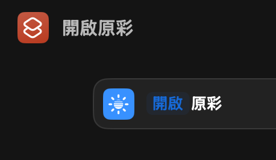

# 腳本用途

偵測到 paperlike256c 螢幕，就切換淺色模式、關閉原彩顯示；反之切換至深色模式、開啟原彩顯示

# 前置步驟

1. 需搭配 BetterTouchTool，當觸發接入螢幕事件時，執行此 bash 腳本

   在 BetterTouchTool 的 Automations & Named & Other Triggers 新增觸發器 Screen/Display Did Connect ，並新增 Execute Shell Script / Task 的 action，填入本專案腳本路徑。

   

2. 新增 名稱為 關閉原彩 與 開啟原彩 的 捷徑

   
